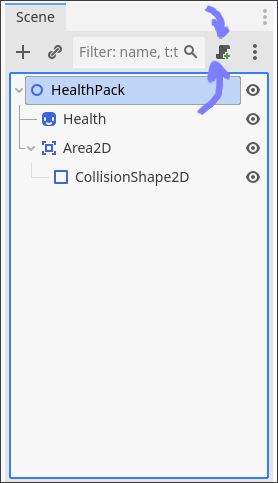
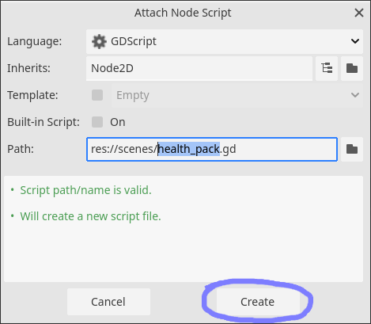
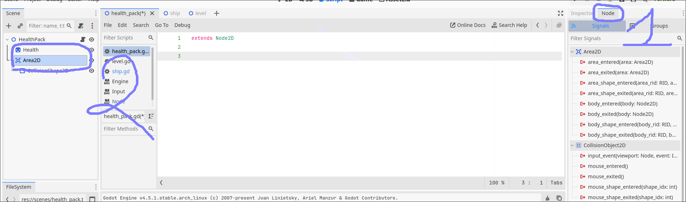
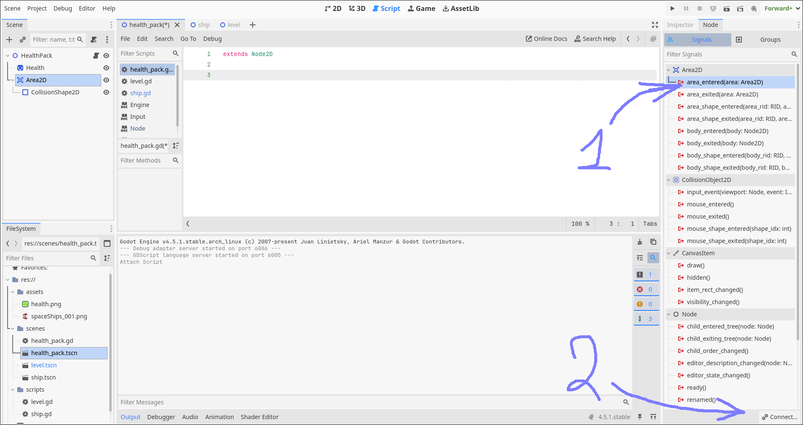
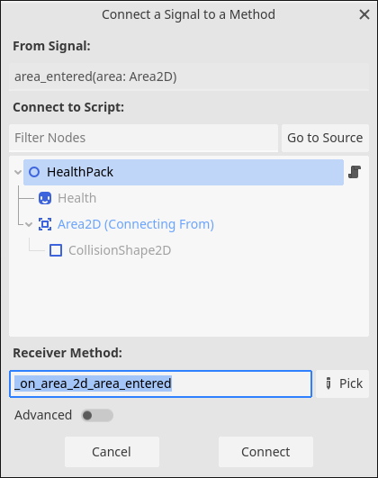

### Колізія 2(Collision)

В цій роботі будемо підв'язувати додаткову логіку яка буде опрацьовувати взаємодію з нашими Health пакетами

1. Скачуємо проект - [link](collision/assets/ship_movement_2_(copy)_2025-11-24_01-54-35.zip)

1. Імпортуємо та відкриваємо проект

1. Відкриваємо health_pack.tscn(в FileSystem) клікаючи на ньому двічі

1. Виділяємо нашу головну Node і приєднуємо новий скрипт

    
    

1. Тепер переходимо в вкладку Node та виділяємо Area2D

    

1. Приєднуємо(виділяємо і натискаємо Connect) на area_entered(area:Area2D)
    > [!NOTE]
    > area_entered це подія яка стається коли дві Area2d налягають на одна одну

    

1. Перевіряємо що у нас виділений HealthPack і що Receiver Method - _on_area_2d_area_entered(тобто що ми підключаємося до правильної події). І натискаємо Connect

    

1. Змінюємо код в скриптові для health_pack.gd [Як це читати?](../diff-read.md)
    ```diff
    diff --git a/scenes/health_pack.gd b/scenes/health_pack.gd
    new file mode 100644
    index 0000000..d91ee23
    --- /dev/null
    +++ b/scenes/health_pack.gd
    @@ -0,0 +1,4 @@
    +extends Node2D
    +
    +func _on_area_2d_area_entered(area: Area2D) -> void:
    +       queue_free()
    ```

    Теорія по [queue_free](../queue_free.md)

1. Зберігаємо і запускаємо. Перевіряємо що при дотику наші health_pack зникають
