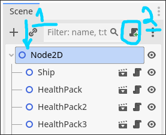
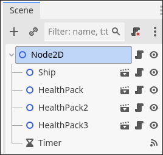
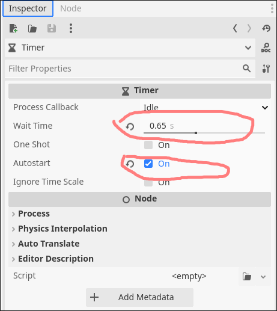
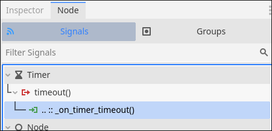
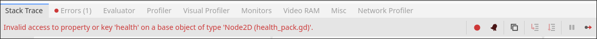
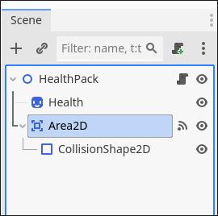
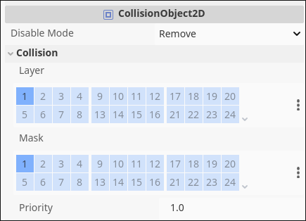
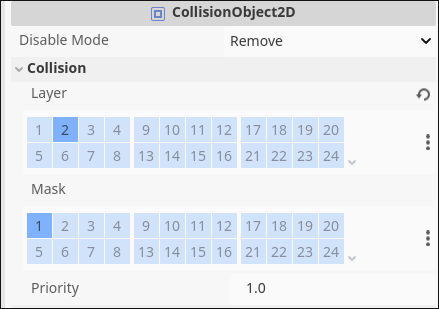
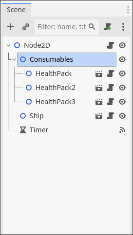

## Рандомізація та динамічні об'єкти

В цьому розділі ми розглянемо як додавати об'єкти динамічно до гри

---

1. Нам потрібно відкрити level.tscn це буде наше головне місце куди ми покладемо логіку для створення додаткових об'єктів. Знаходимо Node2D і приєднуємо новий скрипт до неї.

    

1. Створюємо **Timer** як нащадка Node2D

    

1. Налаштовуємо наш таймер в Inspector. Включимо **Autostart** і поставимо **Timeout** на 0.65

    

1. З'єднаємо timout() на скрипт в Node2D

    

1. Зробимо для початку так щоб у нас з'являлися додаткові об'єкти. Для цього ми використовуємо preload+instantiate. preload() - завантажує опис об'єкту з файлової системи в пам'ять, instantiate() - по опису створює об'єкт типу Node. Так як наш обєкт в скрипті позначений як 'extends Node2D' то ми можемо без проблем використати **as Node2D** щоб перетворити Node в Node2D, якщо ми цього не зробимо то нам будть недоступні x,y позиції об'єкту. Ну і наостанок add_child - який додає наш об'єкт як нащадка Node2D(тому який знаходиться в level)

    ```gdscript
    extends Node2D

    func _on_timer_timeout() -> void:
        var health_pack = preload("res://scenes/health_pack.tscn").instantiate() as Node2D
        add_child(health_pack)
    ```

    Є проблема - гра зупиняється з помилкою

    

1. Наша помилка виникає через те що health_pack має зону колізії і він може взаємодіяти з іншим health_pack. Щоб виправити це нам потрібно змінити властивості зони для health_pack, переходимо в health_pack.tscn, знаходимо Area2D, відкриваємо Inspector, знаходимо там Collision/Layer, Collision/Mask

    

    

1. Layer говорить до якої групи належить наш об'єкт, у даному випадку це група 1, a Mask вказує з якою групою взаємодіє наш об'єкт. У ship теж такі самі налаштування, тобто Ship 1-1 та HealthPack 1-1, що дозволяє їм взаємодіяти. Щоб заборонити взаємодію HealthPack - HealthPack нам достатньо змінити Layer для HealthPack на 2

    

    Чудово гра більше не крашиться але всі об'єкти створюються в одній точці - лівому верхньому кутку. Це все тому що ми лише створили ноду без зміни її позиції, а у такому випадку її координати будуть (0, 0)
 
1. Додамо трохи рандомізації позиції(level.gd). Для цього ми будемо використовувати розміри нашого viewport та функцію для рандомізації randf_range яка здатна генерувати число в проміжку [від, до], відповідно як проміжок ми використаємо розміри viewport та його позицію

    ```gdscript
      extends Node2D
 
      func _on_timer_timeout() -> void:
          var health_pack = preload("res://scenes/health_pack.tscn").instantiate() as Node2D
    ~     var viewport_rect = get_viewport_rect()
    ~     health_pack.position = Vector2(
    ~         randf_range(viewport_rect.position.x, viewport_rect.size.x),
    ~         randf_range(viewport_rect.position.y, viewport_rect.size.y))
          add_child(health_pack)
    ```

    Є невелика графічна проблема - наші об'єкти можуть знаходитися на краю нашого viewport.

1. Щоб з цим справитися нам потрібно зменшити розміри зони спавну. Створимо змінну дамо їй значення 16(половина спрайту нашого health_pack), використовуємо лише половину бо центр нашого HP об'єку лежить в центрі 32 / 2 = 16, тому центр потрібно змістити лише на половину

    ```gdscript
      extends Node2D
  
    ~ var margin = 16
  
      func _on_timer_timeout() -> void:
          var health_pack = preload("res://scenes/health_pack.tscn").instantiate() as Node2D
          var viewport_rect = get_viewport_rect()
    ~     health_pack.position = Vector2(
    ~         randf_range(viewport_rect.position.x + margin,
    ~                     viewport_rect.size.x - margin),
    ~         randf_range(viewport_rect.position.y + margin,
    ~                     viewport_rect.size.y - margin))
          add_child(health_pack)
    ```

1. Змінимо наш код щоб кількість одночасно існуючих аптечок була лише 5. Для початку додамо нову Node2D куди перемістимо всі наші статичні аптечки, дамо їй назву Consumables(переклад - витратні матеріали). А код змінимо так щоб наші нові апетечки додавалися до нової ноди

    

    ```gdscript
      extends Node2D
  
      var margin = 16
  
    ~ @onready var consumables: Node2D = $Consumables
  
      func _on_timer_timeout() -> void:
          var health_pack = preload("res://scenes/health_pack.tscn").instantiate() as Node2D
          var viewport_rect = get_viewport_rect()
          health_pack.position = Vector2(
              randf_range(viewport_rect.position.x + margin,
                          viewport_rect.size.x - margin),
              randf_range(viewport_rect.position.y + margin,
                          viewport_rect.size.y - margin))
    ~     consumables.add_child(health_pack)
    ```

1. Обмежимо власне спавн через простий **if**
    ```gdscript
      extends Node2D
  
      var margin = 16
  
      @onready var consumables: Node2D = $Consumables
  
      func _on_timer_timeout() -> void:
    ~     if consumables.get_child_count() < 5:
    ~         var health_pack = preload("res://scenes/health_pack.tscn").instantiate() as Node2D
    ~         var viewport_rect = get_viewport_rect()
    ~         health_pack.position = Vector2(
    ~             randf_range(viewport_rect.position.x + margin,
    ~                         viewport_rect.size.x - margin),
    ~             randf_range(viewport_rect.position.y + margin,
    ~                         viewport_rect.size.y - margin))
    ~         consumables.add_child(health_pack)
    ```

## Додаткові завдання

1. Додати видалення аптечок по таймеру
1. Зробити так щоб об'єкти не могли спавнитися один на одному
1. Створити зону в якій корабель отримує постійну шкоду -10 хп