### UI

Будемо додавати додаткові елементи які відповідатимуть за відображення

1. Потрібно відредагувати код нашого **HealthPack**, в файловій системі **FileSystem** відкриваємо health_pack.tscn

    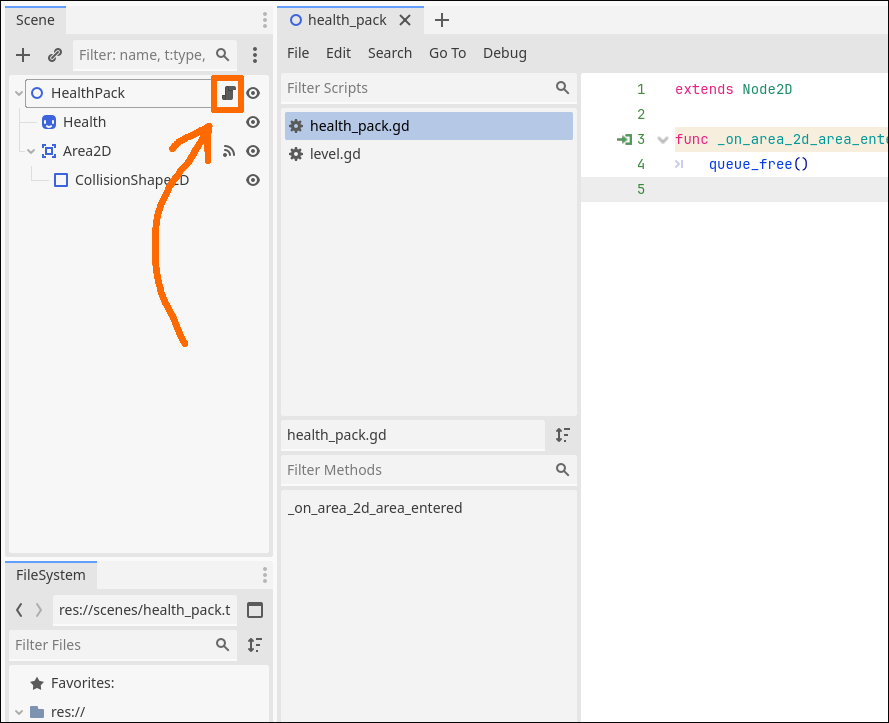

1. Додамо **exported property** до нашого файлу, це дозволить нам управляти даними прямо з **Inspector**

    ```gdscript
    @export
    var health_regain : int = 10
    ```

    | Частина | Опис |
    |-|-|
    | @export | **атрибут** претворює змінну в таку яка доступна з панелі **Inspector** |
    | var | говорить двигуну що потрібно виділити частину памяті для збереження/читання |
    | int | відповідає за значення які можуть бути записані в пам'ять(в даному випадкові -2, -1, 0, 1, 2, 3... тобто цілі числа) |
    | = 10 | значення яке буде записано з самого початку |

    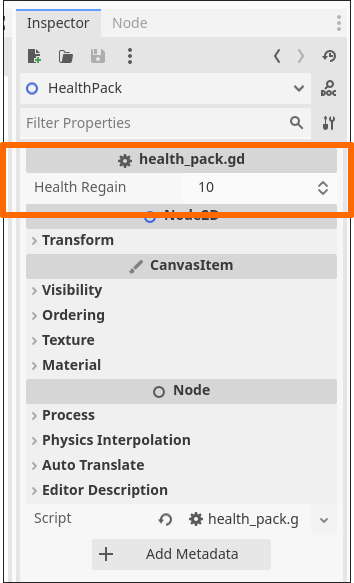

1. Перейдемо до **ship.tscn** і додамо нову ноду - **Control**, розташуємо її останньою в списку

    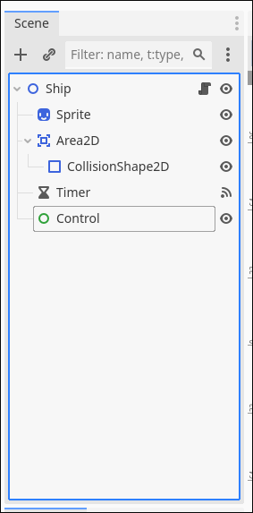

1. Перейменуємо **Control** в **UI**

1. Виділимо **UI** і додамо ще одну ноду - **ProgressBar**

    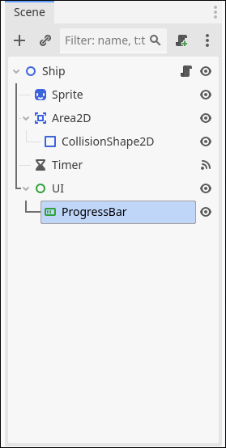

1. Перейменуємо **ProgressBar** в **HealthBar**

    ! Пильнуйте щоб порядок та приналежність(тобто яка нода знаходиться в якій) були правильними

1. Виділіть **ProgressBar** натисніть **[W]** і премістіть його трохи вище корабля(затиснули мишкою та претягнули)

    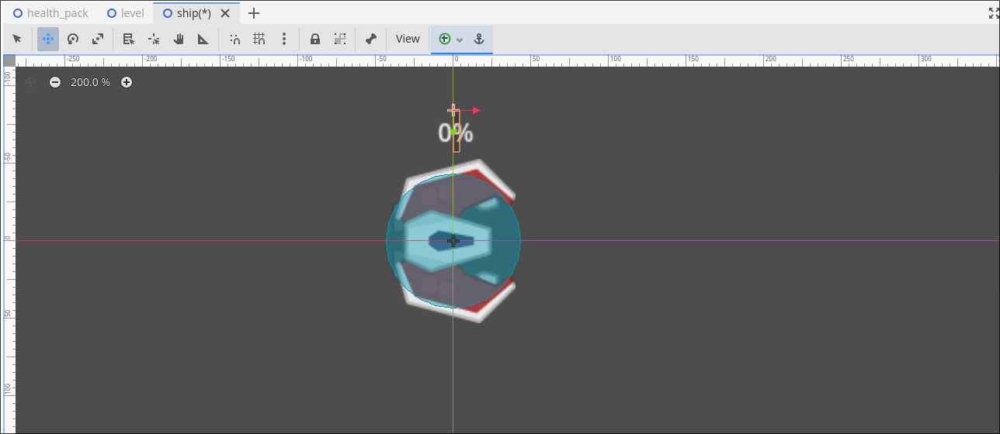

1. Тепер розтягнемо самий **ProgressBar**, натискаємо **[Q]**, на об'єктові зявляться кружечки за які ми можемо тягнути мишкою. Розтягніть приблизно так як на картинці. Опісля знову премістіть об'єкт

    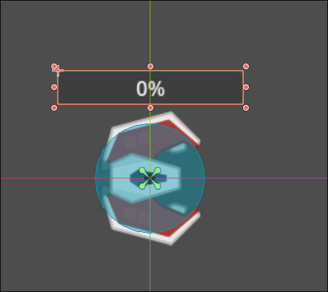

1. Вимикаємо в **Inspector** - **Show Percentage**. Це відповідає за показ тексту

    

1. Змінимо значення **Value** на 50. Можна легко помітити що наш HP bar не зовсім 'стандартний' як для гри(зазвичай вони мають зелений колір, або хоча би якийсь колір)

    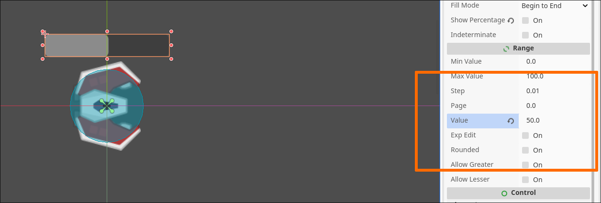

1. Тому змінимо наш колір на зелений. Для цього нам потрібно знайти **Theme Overrides** в **Inspector**(можиливо потрібно буде поскролити щоб знайти поле)

    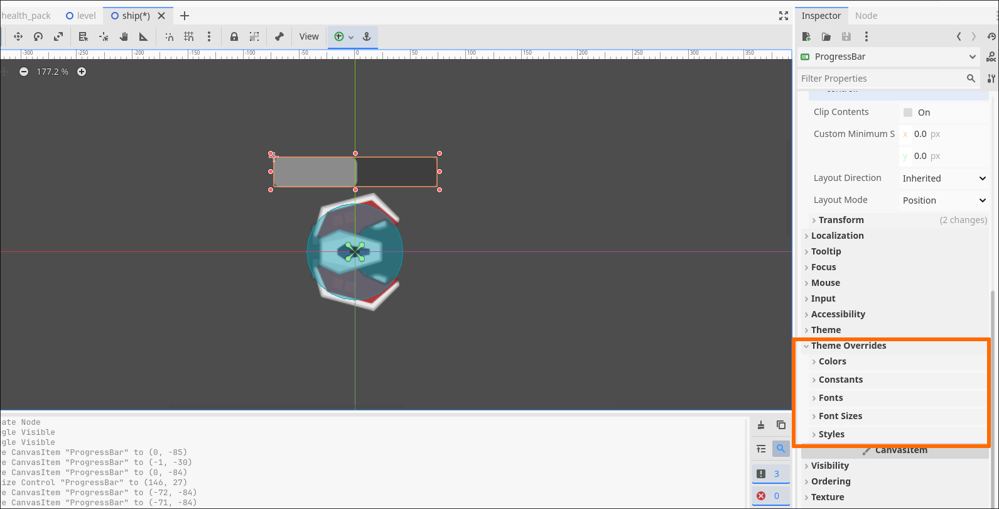

1. Натискаємо на нього далі **Styles**->**Fill** обираємо **StyleBoxFlat**  ->**BG Color** і вибираємо зелений

    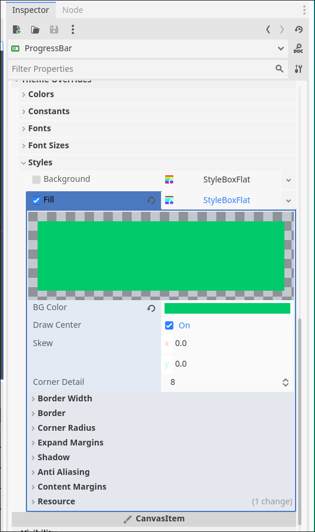

1. Додамо невелику деталь для краси - заокруглені краї. Воно знаходиться в **Styles** -> **Corner Radius**. Виставимо в всі поля 10(можете поставити значення яке вам візуально подобається)

    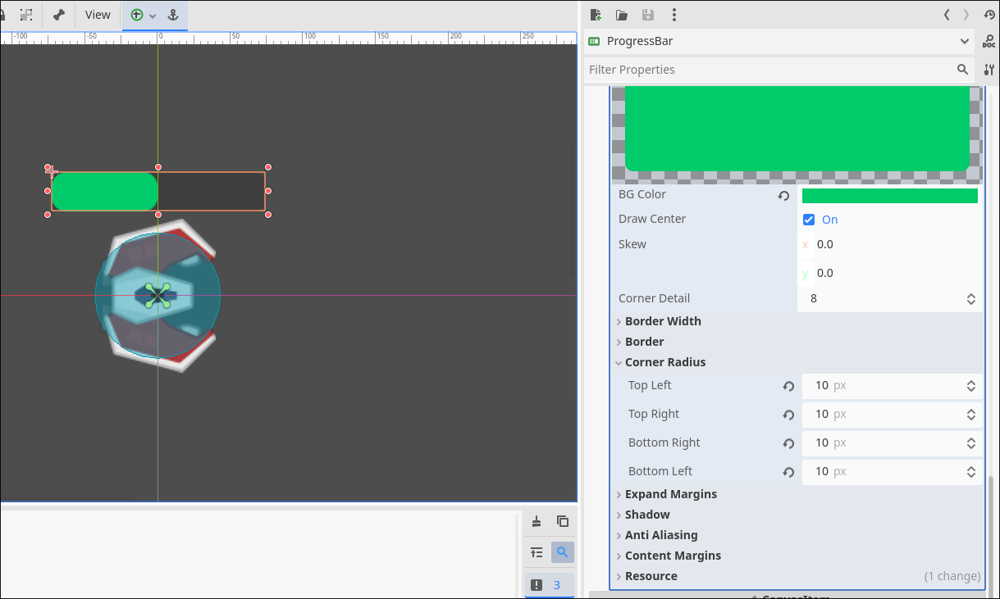

1. Змінимо також краї - **Styles**->**Border**->**Color** на який вам подобається і **Styles**->**Border Width**

    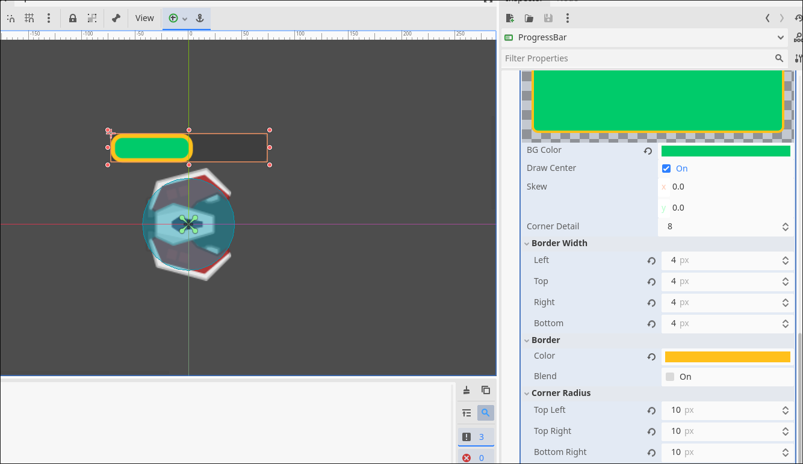

1. Тепер нам потрібно додати логіку - Щоб при дотику до **HealthPack** здоров'я збільшувалося. Тому відкриваємо скріпт нашого корабля і додаємо до списку **var's** ще одну вона буде відповідати за кількість здоров'я корабля

    ```gdscript
    var health : int = 50
    ```

    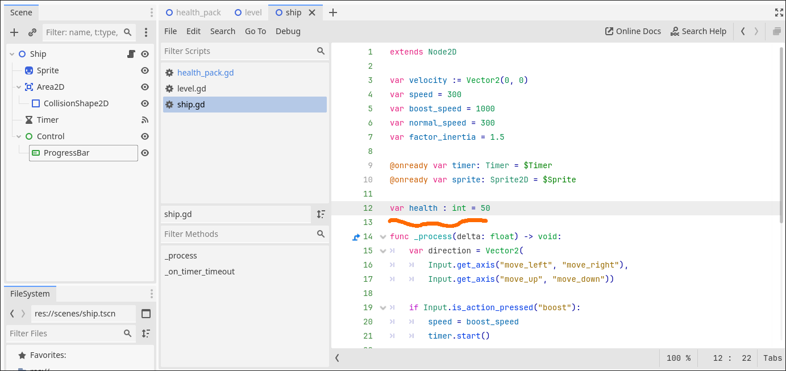

1. Перейдемо до скріпту в **HealthPack** і додамо на початок функції **_on_area_2d_area_entered**

    | Частина | Опис |
    |-|-|
    | . | відповідає за доступ до чогось в чомусь в нашому випадку є дві крапки для виклику функції та доступу до властивості здоров'я |
    | get_parent() | Виклик функції щоь отрамати батьківську ноду(тобто ту яка містить Area2D) |
    | health | var для здоров'я яке ми додали на попередньому крокові |
    | += health_regain | зчитати значення додати до нього health_regain(10) і записати назад |
    ```gdscript
        area.get_parent().health += health_regain
    ```

    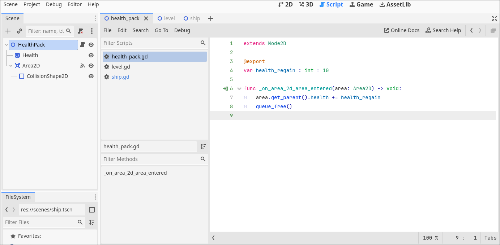


1. Запустимо програму **F5** і подивимося чи воно працює

    

1. Щось явно не так з виконанням. Блоки з здоров'ям зникають, але воно не додається до нашого здоров'я. Проблема в тому що змінили виключно **var** тобто числове значення і не додали логіку яка буде змінювати наш **ProgressBar**. Виправимо це, перейдемо в **ship.gd** і додамо логіку
    
      Частина | Опис |
    |-|-|
    | set(value): | ми говоримо дивигуну що хочемо додати лоіку яка буде виконуватися при записі **value** це значення яке ми отримуємо |
    | $UI/ProgressBar | Для того щоб отримати доступ до **ProgressBar** ми використовуємо $ + шлях, так як ProgressBar належить UI то UI йде першим(як ніби папки в файловому менеджері операційної системи) |
    ```gdscript
        var health : int = 50:
            set(value):
                health = value
                $UI/ProgressBar.value = health
    ```
    
    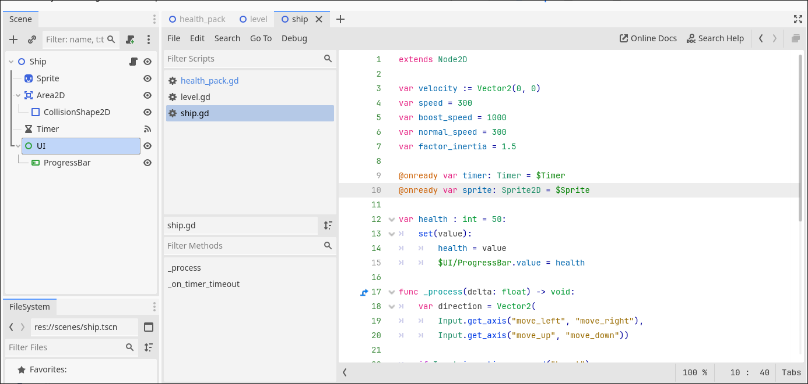

1. Запускаємо